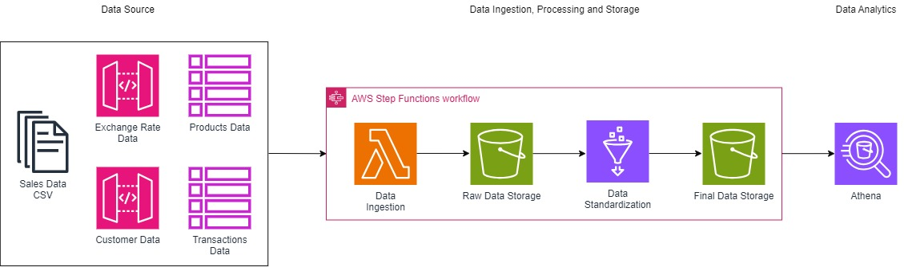
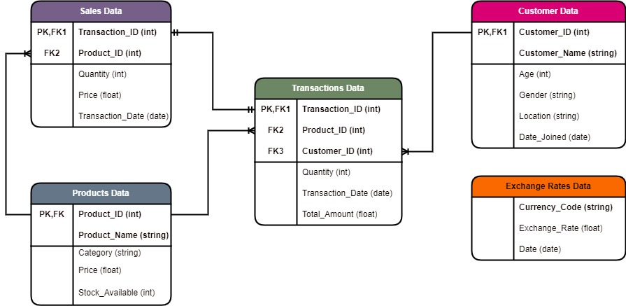

# Data Engineering Pipeline: Integration and Processing

Welcome to the Data Engineering Pipeline project! This repository contains a robust and scalable data engineering pipeline designed to integrate and process data from multiple sources, ultimately delivering a standardized dataset ready for deployment in a cloud environment.

## Cloud Architecture

This AWS cloud architecture diagram illustrates a data processing workflow that involves several key steps, from data ingestion to analytics. Here's a breakdown of the components:
1. Data Source:
    - Sales Data CSV: Represents the raw sales data stored in CSV format.
    - Exchange Rate Data: Data regarding currency exchange rates as an external API.
    - Customer Data: Information about customers, which is an internal API
    - Transactions Data: Data about individual transactions from database.
    - Products Data: Information about products, stored in a database.
2. AWS Step Functions Workflow: 
    - This is the orchestration layer that coordinates the data ingestion, processing, and storage activities.

3. Data Ingestion (AWS Lambda):
    - AWS Lambda: A serverless compute service that handles the data ingestion process, possibly extracting, transforming, and loading (ETL) the data from the various sources.

4. Raw Data Storage (Amazon S3): 
    - The raw ingested data is stored in Amazon S3, which is used as a scalable and durable storage solution.

5. Data Standardization (AWS Glue):
    - AWS Glue function is used to standardize the data, ensuring consistency across the dataset before further processing.

6. Final Data Storage (Amazon S3):
    - The standardized data is again stored in Amazon S3, ready for further analysis.

7. Data Analytics (Amazon Athena):
    - Amazon Athena, a serverless query service, is used to perform data analysis on the stored, standardized data.

This architecture is well-suited for handling large volumes of diverse data types, performing ETL operations, and facilitating data analysis in a scalable and efficient manner.

## Tech Stack

**Programming Language:** Python

**Scripting Language:** SQL

**API:** Postman

**Amazon Web Sevices:** Simple Storage Service, AWS Lambda, AWS Glue, AWS Step Functions, AWS Athena, AWS Eventbridge

## Source Data
Here is the data used for this project 
### Sales Data: CSV Files
The Sales Data dataset, sourced from a CSV file contains transaction records with key details including following columns:
- Transaction_ID (int)
- Product_ID (int)
- Quantity (int)
- Price (float)
- Transaction_Date (date)
### Exchange Rates: External API
The Exchange Rates dataset provides daily exchange rate information retrieved from an external API:
- Currency_Code (string)
- Exchange_Rate (float)
- Date (date)
### Customer Data: Internal API
The Customer Data dataset, accessed via an internal API, containsfollowing information:
- Customer_ID (int)
- Customer_Name (string)
- Age (int)
- Gender (string)
- Location (string)
- Date_Joined (date)
### Database: Postgresql
#### Products Data: Table
The Product Data dataset, retrieved from a PostgreSQL database, includes:
- Product_ID (int) - Primary Key
- Product_Name (string)
- Category (string)
- Price (float)
- Stock_Available (int)
#### Transactions Data: Table
The Transactions Data dataset, retrieved from a PostgreSQL database, includes:
- Transaction_ID (int) - Primary Key
- Customer_ID (int) - Foreign Key
- Product_ID (int) - Foreign Key
- Quantity (int)
- Transaction_Date (date)
- Total_Amount (float)
## Data Model

## Script for Project
### Data Ingestion: code/data_ingestion.py
The Python script is designed to aggregate data from multiple sources, including a CSV file, external and internal APIs, and a PostgreSQL database. It reads and processes this diverse data, then stores the raw data into an Amazon S3 bucket designated for raw data. This preprocessing step ensures that the data is centrally located and readily available for further transformation and analysis. After transformation this data will deleted to avoid duplication of data.
### Data Standardization: code/data_standardization.py
The Python script performs essential data processing tasks, including preprocessing, standardization, and transformation. It takes raw data from an S3 bucket, applies preprocessing steps to clean and prepare the data, standardizes it to ensure consistency across datasets, and finally transforms it into a structured format suitable for analysis. This final dataset is then ready for downstream applications, such as reporting or analytics.
